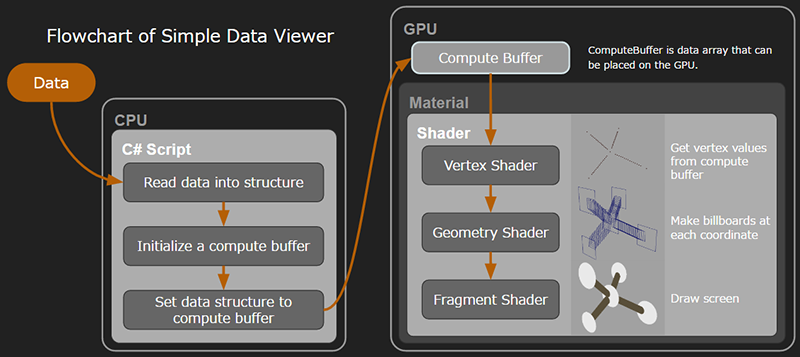
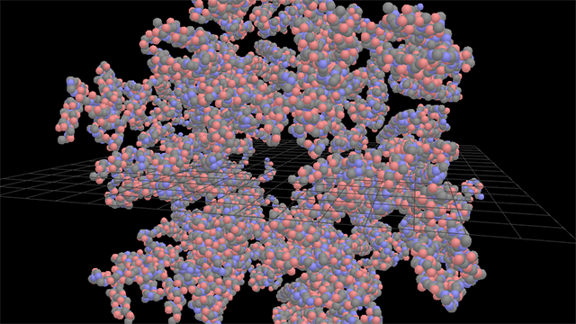
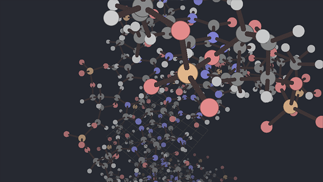
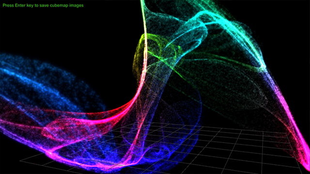
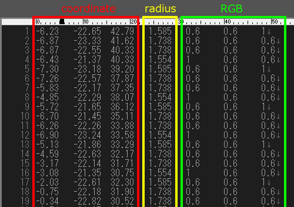

# SimpleDataViewer
Made with Unity 5.5.0f3

### Flowchart
 

### Demo1
It is a sample scene just to read external ascii data and display it.
 

### Demo2
It is a sample scene with fog effect added.
 

### Demo3
The blend mode is Soft Additive Blend.  
Cubemap images are saved by pressing the Enter key.
 

### Data List
#### Chaos Graphic
chaosA.txt  
chaosB.txt

#### Molecular Model
DELTAMBD_GAG_PROTEIN.txt  
DNA_TypeA_AGCT_4_ballAndStick.txt  
DNA_TypeB_AGCT_4_ballAndStick.txt

### Data Format
 
